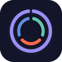

# Dominik Drąg

**Independent Swift engineer & consultant · Warsaw, Poland**

I build native apps and help teams work better with AI. I help teams build reliable iOS and macOS products and put AI to work in their everyday workflow. I also build my own apps and developer tools, putting these approaches into practice.

[Website](https://dominikdrag.com/) · [Consulting](https://dominikdrag.com/consulting/) · [Work](https://dominikdrag.com/work/) · [Résumé](https://dominikdrag.com/resume/) · [hello@dominikdrag.com](mailto:hello@dominikdrag.com)

## Where I can help

- **AI workflows for your team:** reusable skills, connected tools, and verification loops, with hands-on guidance to put them into practice.
- **On-device AI & audio:** local model integration, on-device transcription, text-to-speech, and audio capture.
- **Architecture & reliability:** intermittent failures, Swift concurrency, module boundaries, and build or release bottlenecks.

## iOS apps

Designed and built by me. All available on the App Store.

| | App | What it does | Links |
| --- | --- | --- | --- |
|  | **Launch Control** | Plan your morning backward from the time you need to leave. | [Website](https://dominikdrag.com/launch-control/) · [App Store](https://apps.apple.com/app/apple-store/id6805529235?pt=126891721&ct=github&mt=8) |
|  | **DoseWise** | Keep medication schedules and dose history in one place. | [Website](https://dominikdrag.com/dosewise/) · [App Store](https://apps.apple.com/app/apple-store/id6812802587?pt=126891721&ct=github&mt=8) |
|  | **Closed List** | Choose a finite list of commitments and know when you’ve done enough. | [Website](https://dominikdrag.com/closed-list/) · [App Store](https://apps.apple.com/app/apple-store/id6813543862?pt=126891721&ct=github&mt=8) |
|  | **Clear Intervals** | Simple work and rest timers for your workouts. | [Website](https://dominikdrag.com/clear-intervals/) · [App Store](https://apps.apple.com/app/id6811099903) |
|  | **InTouch** | Keep up with the people who matter to you. | [Website](https://dominikdrag.com/intouch/) · [App Store](https://apps.apple.com/app/apple-store/id6477324916?pt=126891721&ct=github&mt=8) |
|  | **Carried** | Put what’s on your heart into words and receive a Christian prayer. | [Website](https://dominikdrag.com/carried/) · [App Store](https://apps.apple.com/app/apple-store/id6813835350?pt=126891721&ct=github&mt=8) |

## Developer tools

**[DD Skills](https://github.com/dominikdrag/ddskills)** — the open-source agent skills I use in my own development practice. Each skill packages instructions with the scripts, templates, or references it needs:

- **Apple Verification Loop** — focused Apple app checks, with isolated device testing when needed.
- **Transcribe & Diarize** — a timestamped, speaker-labelled transcript of a recording, on your Mac.
- **Maintain Implementation Notes** — implementation decisions, open questions, and verification evidence in one HTML page.
- **Orchestrate Implementation Run** and **Coordinate Multi-Ticket Run** — split work across agents and bring it together through review and verification.
- **App Social Campaign** and **Social Campaign Lab** — app campaigns with finished posts, Reels, captions, and a review pack.

Earlier Claude Code plugins, no longer actively maintained:

- **[Devflow](https://github.com/dominikdrag/devflow)** — take a feature from exploration and planning to implementation and review.
- **[Bug Fix](https://github.com/dominikdrag/bug-fix)** — go from a bug report to a verified fix with root-cause investigation.
- **[Code Explain](https://github.com/dominikdrag/code-explain)** — find your bearings in unfamiliar code through its history, tests, and design.

## Background

I’ve worked on native apps since 2020, across banking and fintech, NordVPN’s macOS product at Nord Security, and on-device AI at Littlebird, where I built the local meeting transcription pipeline. I now focus on consulting and shipping my own apps and developer tools.

**Have a native app or AI workflow in mind?** [Tell me about your project.](https://dominikdrag.com/consulting/)
